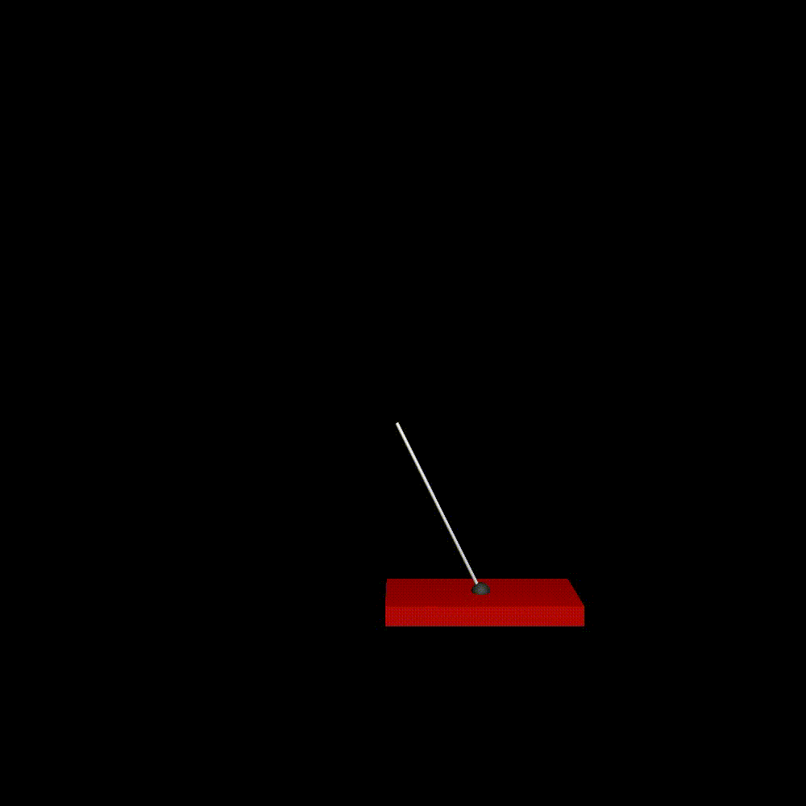
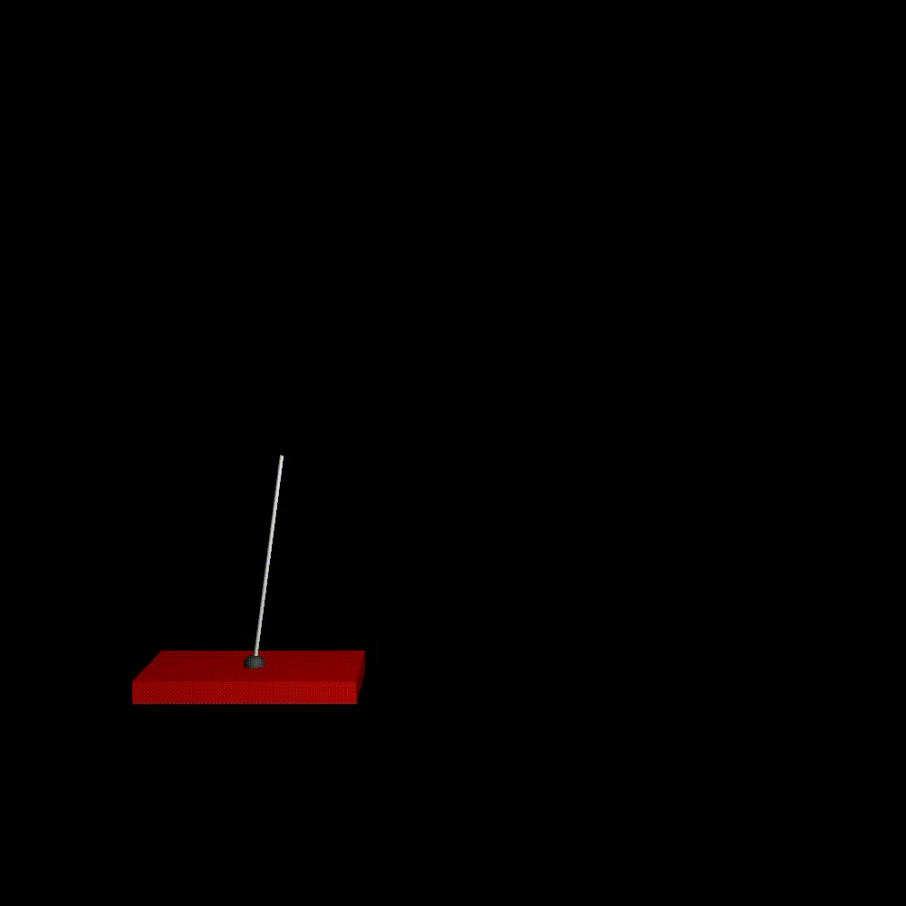

Cart Poll (Q-Learning)
===

### Setup

```shell
conda env create -f environment.yaml
```

### Run

```shell
# normal Q-learning
python main.py
# deep Q-learning
python main.py --dqn
```

### Results

**DQN (0 steps)**  


**DQN (1000 steps)**  


**DQN (2000 steps)  


**DQN (3000 steps)**  


**DQN (4000 steps)**  


**DQN (5000 steps)**  

