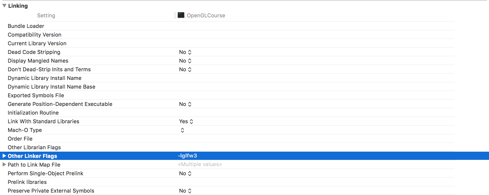

*********************************
GLFWの設定 (初回の設定)
*********************************

このコースではOpenGLを利用するためにGLFW(OpenGL Frameworkの略)というライブラリを使用します。
以下では、WindowsとMacOSでの開発環境の設定方法についてご紹介します。

Windowsの場合
----------------

Visual Stuidoのインストール
^^^^^^^^^^^^^^^^^^^^^^^^^^^^^^^

Windowsの場合にはVisual Studioを使うことをお勧めします。
Visual Studioは現在Community版が無料で使用可能なので、そちらを利用します。

| **Visual Studioのダウンロードページ**
| https://www.visualstudio.com/ja/downloads/
|

こちらからファイルをダウンロード後、インストーラを実行します。
注意点として、開発に用いるプログラミング言語であるC++は、現在の初期設定では
使用できないようになっているので、必要なコンポーネントでVisual C++にチェックを入れます。

GLFWのインストール
^^^^^^^^^^^^^^^^^^^

GLFWの公式ページからコンパイル済みのライブラリをダウンロードします。

| **GLFWのダウンロードページ**
| http://www.glfw.org/download.html
|

上記のウェブページを開いて、中央にある「Windows pre-compiled binaries」から、
ライブラリをダウンロードします。こちらには32bitのものと64bitのものがありますが、
現在のコンピュータであれば、おおよそ64bitのものをダウンロードすれば大丈夫だと思います。

ダウンロードが完了したら、これを適当なディレクトリに配置します。標準的には、
**C:\Libraries\opengl** のようなディレクトリを作成して、その中に置くのが良いかと思います。

Visual Studioプロジェクトの作成
^^^^^^^^^^^^^^^^^^^^^^^^^^^^^^^^^^^

ここまで設定が完了したら、実際にVisual Studioでサンプルプログラムをビルドします。
まずVisual Studioを開いて「スタートページ」から「新しいプロジェクト...」をクリックします。

そこで「空のプロジェクト」を選択し、プロジェクト名、およびソリューション名を入力します。
ここでプロジェクト名を入力するとソリューション名も、それに合わせて変更されますが、
これらは必ずしも同じである必要はありません。

今後もこのソリューションを使うことを考えて、プロジェクト名は「000_environment_setup」、
ソリューション名は「OpenGLCourse」などにしておくと良いかと思います。

.. image:: ../figures/project_setting.jpg

GLFWを使うためのプロジェクト設定
^^^^^^^^^^^^^^^^^^^^^^^^^^^^^^^^^^

GLFWを使用するためには、プロジェクトの設定をする必要があります。設定する箇所は3か所です。

まず「ソリューションエクスプローラー」からプロジェクト名「000_environment_setup」を右クリックし、
一番下にある「プロパティ」を選びます。そうすると「000_environment_setupのプロパティページ」という
ウィンドウが出てくると思います。

この画面が出たら、左上にある「構成(C)」というドロップダウンメニューから「すべての構成」を選びます。

.. image:: ../figures/project_property_001.jpg

続いて、画面左側の「構成プロパティ」から「VC++ディレクトリ」を選び、
「インクルードディレクトリ」および「ライブラリディレクトリ」に以下の文字列を追加します。

| **インクルードディレクトリ**
| C:\Libraries\opengl\glfw-3.2.1.bin.WIN64\include
|
| **ライブラリディレクトリ**
| C:\Libraries\opengl\glfw-3.2.1.bin.WIN64\lib-vc2015
|

.. image:: ../figures/project_property_002.jpg

最後に、「構成プロパティ」の「リンカー」から「入力」を選びます。その一番上にある
「追加の依存ファイル」に次の文字列を追加します。

| **追加の依存ファイル**
| glfw3.lib
|

以上で設定は完了です。プロパティページ下側にある「OK」を押して、ウィンドウを閉じます。

サンプルプログラムのビルド
^^^^^^^^^^^^^^^^^^^^^^^^^^^^^^^

プログラムを作成するためにはソースコードを書く必要があります。ソースコードは「000_environment_setup」内の
「ソースファイル」というフォルダのアイコンを右クリックして、「追加」→「新しい項目」の順で追加します。

そうすると「新しい項目の追加」というウィンドウが表れるので、そのウィンドウで「C++ファイル」を選び、
名前を「main.cpp」に変更して「追加(A)」ボタンをクリックします。

.. image:: ../figures/add_new_item.jpg

作成されたファイルを開き、以下のソースコードを入力します。内容に関しては、後の章で解説をします。

.. code-block:: cpp
  :linenos:

  #include <cstdio>
  #include <GLFW/glfw3.h>

  static const int WIN_WIDTH   = 500;                 // ウィンドウの幅
  static const int WIN_HEIGHT  = 500;                 // ウィンドウの高さ
  static const char *WIN_TITLE = "OpenGL Course";     // ウィンドウのタイトル

  // ユーザ定義のOpenGLの初期化
  void initializeGL() {
      // 背景色の設定
      glClearColor(1.0f, 0.0f, 0.0f, 1.0f);
  }

  // ユーザ定義のOpenGL描画
  void paintGL() {
      // 背景色の描画
      glClear(GL_COLOR_BUFFER_BIT);
  }

  int main(int argc, char **argv) {
      // OpenGLを初期化する
      if (glfwInit() == GL_FALSE) {
          fprintf(stderr, "Initialization failed!\n");
          return 1;
      }

      // Windowの作成
      GLFWwindow *window = glfwCreateWindow(WIN_WIDTH, WIN_HEIGHT, WIN_TITLE,
                                            NULL, NULL);
      if (window == NULL) {
          fprintf(stderr, "Window creation failed!");
          glfwTerminate();
          return 1;
      }

      // OpenGLの描画対象にWindowを追加
      glfwMakeContextCurrent(window);

      // 初期化
      initializeGL();

      // メインループ
      while (glfwWindowShouldClose(window) == GL_FALSE) {
          // 描画
          paintGL();

          // 描画用バッファの切り替え
          glfwSwapBuffers(window);
          glfwPollEvents();
      }
  }

特に問題がなければ、「Ctrl+Shift+B」を押すことでビルドが成功するはずです。

プログラムは「Ctrl+F5」で実行でき、成功すると赤いウィンドウが表示されるはずです。

ここまでできたら、実際にあとの章のサンプルコードを貼り付けるなどして、動かしてみましょう。

----

MacOSの場合
------------------

MacOSをお使いの方はXcodeを使うことをおすすめします。XcodeはややVisual Studioよりも
機能的には劣るものの、よくできた統合開発環境です。

Xcodeのインストール
^^^^^^^^^^^^^^^^^^^^^

XcodeのインストールはApp Storeから行います。App Storeを開き、右上の検索窓で「Xcode」を検索します。

.. image:: ../figures/search_xcode.jpg

すると上の図のように左上のXcodeが出てくるはずなので、「インストール」をクリックし、インストールを開始します。
少し時間がかかるかと思いますが、単に待っていればインストールが完了するはずです。

GLFWのインストール
^^^^^^^^^^^^^^^^^^^

MacOSの場合には、GLFWをソースコードからコンパイルしてインストールする必要があります。
「ターミナル」を開いて、以下のスクリプトを1行1行実行していきます。

.. code-block:: shell
  :linenos:

  git clone https://github.com/glfw/glfw.git    # ソースコードのダウンロード
  cd glfw                                       # ダウンロードしたソースのディレクトリに移動
  mkdir build && cd build                       # ビルド用のディレクトリを作成して、そこに移動
  cmake ..                                      # CMakeを利用したビルドの準備
  make                                          # ビルド
  sudo make install                             # インストール

上記のインストール方法を使う場合にはGit, CMake, GNU Makeがインストールされている必要があります。
通常、MacBook等を購入した段階でGitとGNU Makeはインストールされているはずですが、
CMakeはインストールされていない可能性があるので、必要であれば以下のページからインストーラを使って、インストールしてください。

| CMakeのダウンロードページ
| https://cmake.org/download/
|

Xcodeプロジェクトの作成
^^^^^^^^^^^^^^^^^^^^^^^^^^^^^^^^^^^

インストールが完了したら早速Xcodeを起動します。起動すると以下のような画面が表示されます。

.. image:: ../figures/xcode_splash.jpg

左側にあるリストから「Create a new Xcode Project」をクリックします。
すると、以下のように、どのようなプロジェクトを作成するのかを指定する画面が表示されます。

.. image:: ../figures/choose_project_type_xcode.jpg

今回は「macOS」の「Command Line Tool」を選択して、右下の「Next」をクリックします。
すると、次はプロジェクトの詳細を設定する画面が現れます。ここは、どのように設定しても
基本は問題ないのですが、一番したの「Language」を「C++」にするのだけは忘れないようにしてください。

.. image:: ../figures/project_detail_xcode.jpg

「Next」をクリックすると、プロジェクトをどこに保存するかを聞かれますが、自分の分かりやすい場所に保存しておけばOKです。
おすすめとしては「Documents」フォルダの中に「Xcode」というディレクトリを作って、その中に保存するやり方です。

GLFWを使うためのプロジェクト設定
^^^^^^^^^^^^^^^^^^^^^^^^^^^^^^^^^^

次にXcodeでGLFWを使うための設定をします。まずはGLFWのインクルードディレクトリと
ライブラリディレクトリの設定です。

上記のやり方でGLFWをインストールしている場合には、それぞれが以下のようなパスになっています。

| **インクルードディレクトリ**
| /usr/local/include
|
| **ライブラリディレクトリ**
| /usr/local/lib
|

Xcodeの画面左側にあるプロジェクト名 (今回の場合は「OpenGLCourse」) をクリックすると、
設定画面が現れるので、その設定画面の「Build Settings」を開きます。

.. image:: ../figures/project_setting_xcode.jpg

この画面を下にスクロールしていくと「Search Paths」という項目が見つかるので、
その中にある「Header Search Paths」および「Library Search Paths」を以下のように編集します。

.. image:: ../figures/search_path_xcode.jpg

次はリンクするライブラリにGLFWを追加します。同じ画面で少し上に戻ると「Linking」という項目が見つかります。

その項目の中段くらいにある「Other Linker Flags」という項目に「-lglfw3」という文字を以下のように設定します。

これでGLFWの設定は完了です。WindowsでVisual Studioを使う場合には、この内容までで設定が終わるのですが、
MacOSを使う場合には以下の「フレームワークの追加」が必要になります。

フレームワークの追加
^^^^^^^^^^^^^^^^^^^^^^^^^

MacOSでGLFWを使うためには、いくつかのフレームワーク(ライブラリの集合みたいなもの)をプロジェクトに
追加する必要があります。

先ほどの設定画面上部で「Build Settings」を選んでいた箇所の一番左にある「General」を選択します。
すると、画面下部に「Linked Frameworks and Libraries」という項目があるので、こちらに使用する
フレームワークを追加していきます。

使用するフレームワークは4種類で「OpenGL」、「Cocoa」、「CoreVideo」、「IOKit」になります。
いずれも「Linked Frameworks and Libraries」項目の下側にある「＋」ボタンを押すと現れる、
以下の画面で検索することにより追加できます。

.. image:: ../figures/add_frameworks.jpg
  :width: 300px

全てのフレームワークを設定すると、以下の画面のようになると思います。

.. image:: ../figures/after_setting_frameworks.jpg

以上でXcodeのプロジェクト設定は完了です。

サンプルプログラムのビルド
^^^^^^^^^^^^^^^^^^^^^^^^^^^^^^^

Xcodeの場合には、上記のやり方でプロジェクトを作成すると、すでに「main.cpp」という
ファイルが作成されています。このファイルを右側のファイルリストから開き、
以下のソースコードを入力します。内容に関しては、後の章で解説をします。

.. code-block:: cpp
  :linenos:

  #include <cstdio>
  #include <GLFW/glfw3.h>

  static const int WIN_WIDTH   = 500;                 // ウィンドウの幅
  static const int WIN_HEIGHT  = 500;                 // ウィンドウの高さ
  static const char *WIN_TITLE = "OpenGL Course";     // ウィンドウのタイトル

  // ユーザ定義のOpenGLの初期化
  void initializeGL() {
      // 背景色の設定
      glClearColor(1.0f, 0.0f, 0.0f, 1.0f);
  }

  // ユーザ定義のOpenGL描画
  void paintGL() {
      // 背景色の描画
      glClear(GL_COLOR_BUFFER_BIT);
  }

  int main(int argc, char **argv) {
      // OpenGLを初期化する
      if (glfwInit() == GL_FALSE) {
          fprintf(stderr, "Initialization failed!\n");
          return 1;
      }

      // Windowの作成
      GLFWwindow *window = glfwCreateWindow(WIN_WIDTH, WIN_HEIGHT, WIN_TITLE,
                                            NULL, NULL);
      if (window == NULL) {
          fprintf(stderr, "Window creation failed!");
          glfwTerminate();
          return 1;
      }

      // OpenGLの描画対象にWindowを追加
      glfwMakeContextCurrent(window);

      // 初期化
      initializeGL();

      // メインループ
      while (glfwWindowShouldClose(window) == GL_FALSE) {
          // 描画
          paintGL();

          // 描画用バッファの切り替え
          glfwSwapBuffers(window);
          glfwPollEvents();
      }
  }

特に問題がなければ、「Command+B」を押すことでビルドが成功するはずです。

プログラムは「Command+R」で実行でき、成功すると赤いウィンドウが表示されるはずです。

ここまでできたら、実際にあとの章のサンプルコードを貼り付けるなどして、動かしてみましょう。
