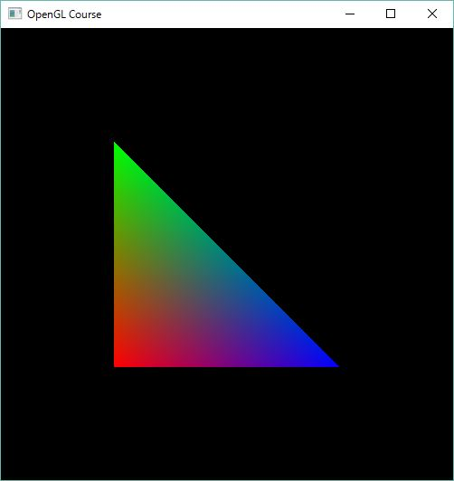

************************************
第2回 三角形を描く |source_code|
************************************

.. |source_code| image:: ../../images/octcat.png
  :width: 24px
  :target: https://github.com/tatsy/OpenGLCourseJP/blob/master/src/002_hello_triangle/002_hello_triangle.cpp

練習
-------
1. 三角形の頂点の位置を変えるとどうなるかを調べる
2. 三角形の頂点の色を変えるとどうなるかを調べる
3. 三角形の頂点の色を部分的にコメントアウトするとどうなるかを調べる
