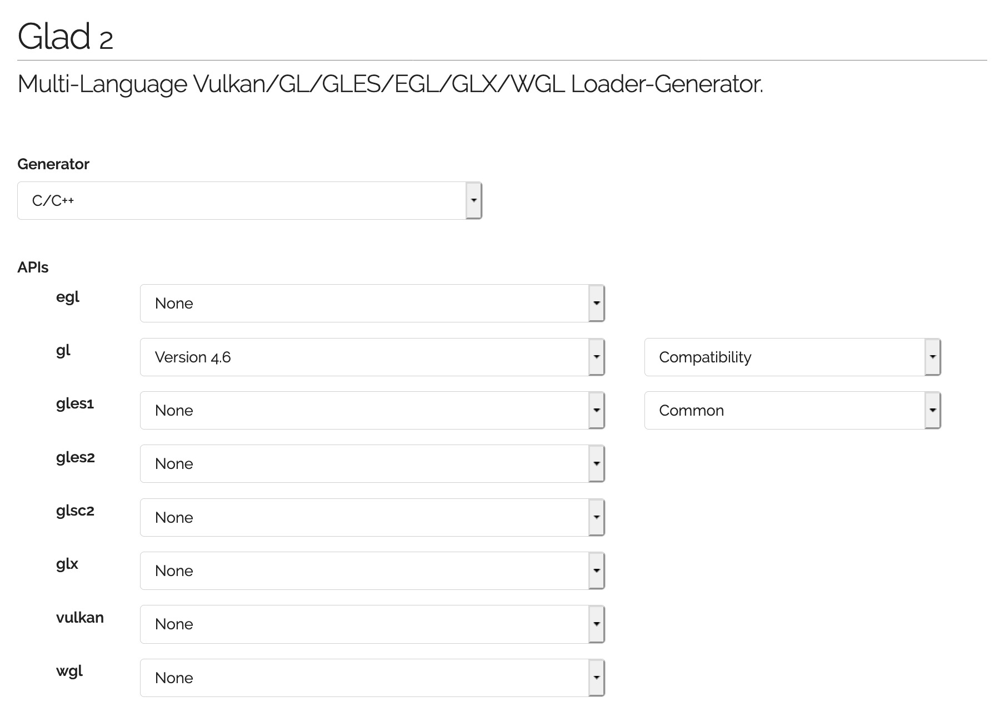

***************************************
OpenGL 3.x/4.xのローダとGLMの設定
***************************************

(この内容は「 :doc:`../hello_shader/index` 」以降に必要になります)

第10回以降のプログラムを動かすためには、比較的新しいOpenGLの機能を使うためのライブラリが必要です。
旧来はGLEW (OpenGL Extension Wrangler Library) というライブラリが有名でしたが、近年は開発が止まっていることもあり、本講義では `GLAD <https://gen.glad.sh/>`_ というライブラリを使います。

GLADはソースコード (\*.c ファイル) を含むものとヘッダだけで利用できるものがあり、本講義では利便性のためにヘッダだけからなるものを用います。このヘッダは、講義のソースコードを配布している `GitHub <https://github.com/tatsy/OpenGLCourseJP/support/glad/glad.h>`_ からダウンロードできる他、 `公式のWebページ <https://gen.glad.sh/>`_ に設定内容を入力してダウンロードすることもできます。

GLADのインストール (Windows/Mac共通)
------------------------------------------------

公式ページ (https://gen.glad.sh/) にアクセスします。GLADにはバージョン1とバージョン2がありますが、ヘッダだけで利用できるバージョン2を今回は使います。

ページが開いたら下の画像のように設定項目を入力し、右下にある「GENERATE」ボタンをクリックします。

.. image:: ./figures/glad_setup_02.jpg

すると下記のような画面が開くので ``glad.zip`` をクリックして、ファイルをダウンロードします。

.. image:: ./figures/glad_download.jpg

このファイルを展開すると ``glad/gl.h`` というファイルが見つかりますので、これを適当な場所におき、自分のソースコードからインクルードするようにします。

サンプルプログラムの実行
-------------------------------------

サンプルプログラムは「第12回シェーダの利用」のソースコードを使用します。

https://github.com/tatsy/OpenGLCourseJP/blob/master/src/hello_shader

コンパイルをするまではこれまで通りですが、今回のファイルにはシェーダのソースコードが含まれるので、
そちらの置き場所を別途設定する必要があります。

サンプルプログラムの中では、 **common.h** というシェーダの置き場所を記したヘッダファイルを
**CMake** を使用して自動生成しています。その元となるファイルが **common.h.in** です。

**CMake** を使わずに、このファイルを作る場合には、**common.h.in** の内容を参考に
以下のような内容を記述したファイルを作ってください。もしMacをお使いで上記の「Copy Files」の設定をした方は、こちらをスキップしても大丈夫です。

.. code-block:: cpp
  :linenos:

  #ifndef _COMMON_H_
  #define _COMMON_H_

  static const char *SOURCE_DIRECTORY = "(ソースコード用のディレクトリ)";
  static const char *SHADER_DIRECTORY = "(シェーダ用のディレクトリ)";
  static const char *DATA_DIRECTORY = "(データ用のディレクトリ)";

  #endif  // _COMMON_H_

サンプルプログラムでは、シェーダのファイルが見つからなければエラーを返すように
していますので、もし実行が上手くいかない場合にはシェーダの置き場所を確認してみてください。

プログラムの変更点①
^^^^^^^^^^^^^^^^^^^^^^^^^^^^^^^

一つ目は使用するOpenGLの種類の設定です。設定項目としては、

1. GLFWにOpenGLのバージョンを指定する
2. GLFWにOpenGLのプロファイルの種類を指定する
3. GLFWにOpenGLの互換性を指定する

これらは以下のように設定できます。

.. code-block:: cpp
  :linenos:

  // OpenGLのバージョン設定 (4を指定すると4.xの中で使用可能なもののうち、最新のものが使われる)
  glfwWindowHint(GLFW_CONTEXT_VERSION_MAJOR, 4);
  // OpenGLのプロファイル (Core, Compatibility) を設定
  glfwWindowHint(GLFW_OPENGL_PROFILE, GLFW_OPENGL_CORE_PROFILE);
  // OpenGLの関数の新しい関数だけを使う場合は GL_TRUE を指定する (初期値は GL_FALSE)
  glfwWindowHint(GLFW_OPENGL_FORWARD_COMPAT, GL_TRUE);

これらの項目はWindowsの場合には特に設定しなくても、最新バージョンのOpenGLでかつ、Compatibility profileを使い、古い関数もサポートする形で初期化されます。一方でMacの場合には、上記の設定をしない場合には、OpenGL 2.1の機能までしか使えないため、設定は必須になります。さらにMacではCore profileのみがサポートされているため、上記の三項目の設定が必要になります。

プログラムの変更点②
^^^^^^^^^^^^^^^^^^^^^^^^^^^^^^^

上記の設定後、OpenGLのライブラリをロードするコードを追加します。具体的には ``glfwMakeContextCurrent`` を呼び出しの下に以下のコードを追加します。

.. code-block:: cpp
  :linenos:

  // OpenGL 3.x/4.xの関数をロードする (glfwMakeContextCurrentの後でないといけない)
  const int version = gladLoadGL(glfwGetProcAddress);
  if (version == 0) {
      fprintf(stderr, "Failed to load OpenGL 3.x/4.x libraries!\n");
      return 1;
  }

  // バージョンを出力する
  printf("Load OpenGL %d.%d\n", GLAD_VERSION_MAJOR(version), GLAD_VERSION_MINOR(version));

``gladLoadGL`` 関数はライブラリの読み込みに成功するとOpenGLのバージョンを表す3桁の整数を返してします (OpenGL 4.5なら450)。もし読み込みに失敗した場合には ``0`` が返ってくるので、これを使って読み込みに成功したかどうかを確認しています。

またその下の ``printf`` では、実際に期待するバージョンのライブラリが読み込めているかどうかを確認しています。特にMacの場合には設定が正しく行えていない場合にバージョン2.1が読み込まれるので注意してください。

プログラムの実行
^^^^^^^^^^^^^^^^^^^

実際にプログラムをビルドして実行結果を確認してください。

上手く実行できると、色付きの立方体が描画されるはずです。

.. image:: ./figures/shader_cube.jpg
  :width: 300px
