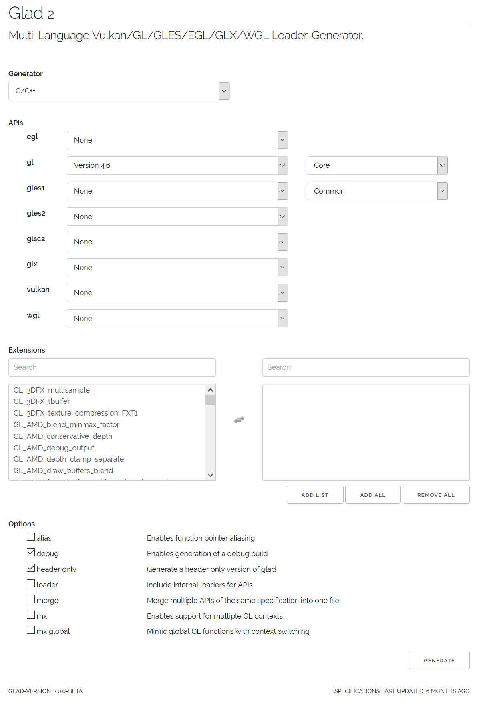

***************************************
OpenGL 3.x/4.xのローダとGLMの設定
***************************************

(この内容は「 :doc:`../hello_shader/index` 」以降に必要になります)

第10回以降のプログラムを動かすためには、比較的新しいOpenGLの機能を使うためのライブラリが必要です。
旧来はGLEW (OpenGL Extension Wrangler Library) というライブラリが有名でしたが、近年は開発が止まっていることもあり、本講義では `GLAD <https://gen.glad.sh/>`_ というライブラリを使います。

GLADはソースコード (\*.c ファイル) を含むものとヘッダだけで利用できるものがあり、本講義では利便性のためにヘッダだけからなるものを用います。このヘッダは、講義のソースコードを配布している `GitHub <https://github.com/tatsy/OpenGLCourseJP/support/glad/glad.h>`_ からダウンロードできる他、 `公式のWebページ <https://gen.glad.sh/>`_ に設定内容を入力してダウンロードすることもできます。

GLADのインストール (Windows/Mac共通)
------------------------------------------------

公式ページ (https://gen.glad.sh/) にアクセスします。GLADにはバージョン1とバージョン2がありますが、ヘッダだけで利用できるバージョン2を今回は使います。

ページが開いたら下の画像のように設定項目を入力し、右下にある「GENERATE」ボタンをクリックします。

すると下記のような画面が開くので ``glad.zip`` をクリックして、ファイルをダウンロードします。

.. image:: ./figures/glad_download.jpg

このファイルを展開すると ``glad/glad.h`` というファイルが見つかりますので、これを適当な場所におき、自分のソースコードからインクルードするようにします。

GLMのインストール (Windowsの場合)
------------------------------------------------

GLMも公式のウェブページからライブラリをダウンロードします。

| **GLMのダウンロードページ**
| http://glm.g-truc.net
|

.. image:: ./figures/glm_top_page.jpg

上記のウェブページの左側にある「Downloads」というリンクをクリックします。
するとダウンロードページに移動するので、その中から最新版である0.9.9.5をダウンロードします (2019年4月1日現在) 。
ダウンロードしたファイルは「glm-0.9.9.5.zip」という名前になっているはずです。

.. image:: ./figures/glm_download_page.jpg

ダウンロードが完了したら、ZIPファイルを展開して適当なディレクトリに配置します。

プロパティシートの更新
^^^^^^^^^^^^^^^^^^^^^^^^^^^^^^^^^^^^^

初回の準備の際に作成したプロパティシートを更新して、GLEWおよびGLMを使用できるようにします。

設定方法に関しては、:doc:`glfw` を参照してください。設定項目は以下の通りです。

VC++ ディレクトリ
""""""""""""""""""""""""""""""""""""

| **インクルードディレクトリ**
| C:\\Libraries\\opengl\\glm-0.9.8.4  (GLM)
|

GLMのインストール (Macの場合)
------------------------------------------------

`GLMのGitHub <https://github.com/g-truc/glm.git>`_ からソースコードを
ダウンロードして、ビルドとインストールを行います。次のコマンドをターミナルで実行してください。

.. code-block:: shell
  :linenos:

  git clone https://github.com/g-truc/glm.git
  cd glm
  mkdir build && cd build
  cmake ..
  make
  sudo make install

これだけでインストールは完了です。

Xcodeの設定
^^^^^^^^^^^^^^^^^^^^^^^^^^^^^^^^^^^^^

Macの場合、上記のコマンドでGLMは ``/usr/local/include`` というシステム全体から見える場所にインストールされるため、Xcodeでインクルード・ディレクトリ等を設定する必要ありません。

サンプルプログラムの実行
-------------------------------------

サンプルプログラムは「第12回シェーダの利用」のソースコードを使用します。

https://github.com/tatsy/OpenGLCourseJP/blob/master/src/hello_shader

コンパイルをするまではこれまで通りですが、今回のファイルにはシェーダのソースコードが含まれるので、
そちらの置き場所を別途設定する必要があります。

サンプルプログラムの中では、 **common.h** というシェーダの置き場所を記したヘッダファイルを
**CMake** を使用して自動生成しています。その元となるファイルが **common.h.in** です。

**CMake** を使わずに、このファイルを作る場合には、**common.h.in** の内容を参考に
以下のような内容を記述したファイルを作ってください。もしMacをお使いで上記の「Copy Files」の設定をした方は、こちらをスキップしても大丈夫です。

.. code-block:: cpp
  :linenos:

  #ifndef _COMMON_H_
  #define _COMMON_H_

  static const char *SOURCE_DIRECTORY = "(ソースコード用のディレクトリ)";
  static const char *SHADER_DIRECTORY = "(シェーダ用のディレクトリ)";
  static const char *DATA_DIRECTORY = "(データ用のディレクトリ)";

  #endif  // _COMMON_H_

サンプルプログラムでは、シェーダのファイルが見つからなければエラーを返すように
していますので、もし実行が上手くいかない場合にはシェーダの置き場所を確認してみてください。

実際にプログラムをビルドして実行結果を確認してください。

上手く実行できると、色付きの立方体が描画されるはずです。

.. image:: ./figures/shader_cube.jpg
  :width: 300px
