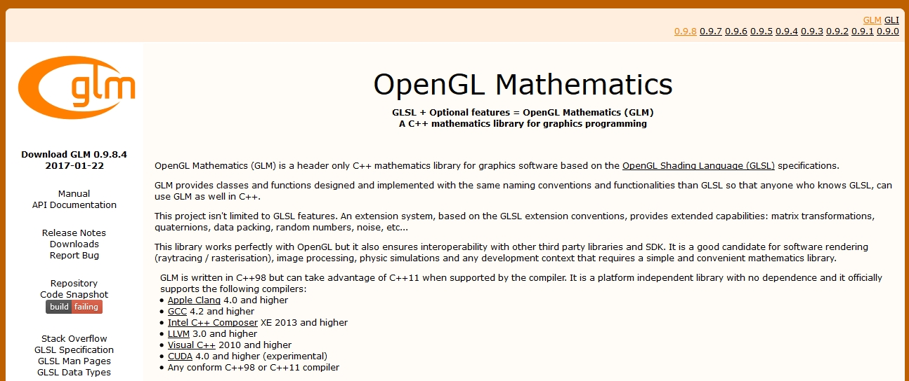
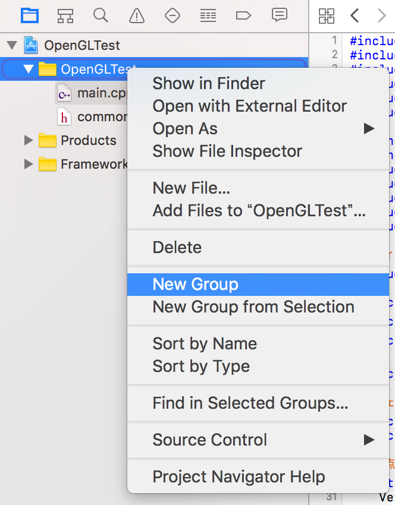
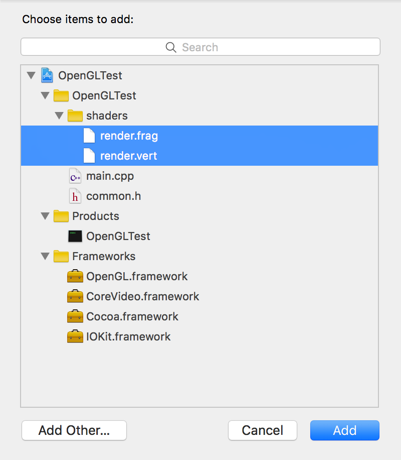
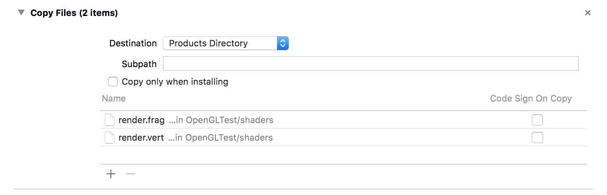

***************************************
GLEWとGLMの設定
***************************************

(この内容は「 :doc:`../hello_shader/index` 」以降に必要になります)

第10回以降のソースコードを動かすためには, 最近のOpenGLの機能を扱うためのライブラリが必要です。
このコースではGLEW (OpenGL Extension Wrangler Library) を使ってプログラムを作ります。

合わせて、ベクトルや行列の計算を簡単に扱うためのライブラリとしてGLM (OpenGL Mathematics) も導入しておきます。

----

Windowsの場合
-------------------------

GLEWのインストール
^^^^^^^^^^^^^^^^^^^^^^^^

GLEWの公式ページからコンパイル済みのライブラリをダウンロードします。

| **GLEWのダウンロードページ**
| http://glew.sourceforge.net/
|

.. image:: ./figures/glew_download_page.jpg

上記のウェブページを開いて、中央にある「Binaries」という文字の右側にある
「Windows 32-bit and 64-bit」というリンクから、ZIPファイルをダウンロードします。
ダウンロードしたファイルは「glew-2.0.0-win32.zip」という名前になっているはずです。

ダウンロードが完了したら、ZIPファイルを解凍し、GLFWの時と同様に適当なディレクトリに配置します。
この講義では、 **C:\\Libraries\\opengl** のようなディレクトリを作成して、
その中に置くことを推奨しています。

GLMのインストール
^^^^^^^^^^^^^^^^^^^^^^^^

GLMも公式のウェブページからライブラリをダウンロードします。

| **GLMのダウンロードページ**
| http://glm.g-truc.net
|

上記のウェブページの左側にある「Downloads」というリンクをクリックします。
するとダウンロードページに移動するので、その中から最新版である0.9.8.4をダウンロードします (2017年5月11日現在)。
ダウンロードしたファイルは「glm-0.9.8.4.zip」という名前になっているはずです。

.. image:: ./figures/glm_download_page.jpg

ダウンロードが完了したら、上記と同様にZIPファイルを解凍して適当なディレクトリに配置します。

プロパティシートの更新
^^^^^^^^^^^^^^^^^^^^^^^^^^^^^^^^^^^^^

初回の準備の際に作成したプロパティシートを更新して、GLEWおよびGLMを使用できるようにします。

設定方法に関しては、:doc:`glfw` を参照してください。設定項目は以下の通りです。

VC++ ディレクトリ
""""""""""""""""""""""""""""""""""""

| **インクルードディレクトリ**
| C:\\Libraries\\opengl\\glew-2.0.0\\include  (GLEW)
| C:\\Libraries\\opengl\\glm-0.9.8.4  (GLM)
|
| **ライブラリディレクトリ**
| C:\\Libraries\\opengl\\glew-2.0.0\\lib\\Release\\Win32 (GLEW, 32bitの場合)
| C:\\Libraries\\opengl\\glew-2.0.0\\lib\\Release\\x64 (GLEW, 64bitの場合)
|

リンカー
""""""""""""""""""""""""""""""""""""

| **追加の依存ファイル**
| glew32.lib (GLEW, 32bit, 64bitとも同じ名前)
|

バイナリファイルの移動
^^^^^^^^^^^^^^^^^^^^^^^^^^^^^^^^^^^^^

GLEWを使用したサンプルプログラムを実行するためには、GLEWのDLLファイルが参照可能な場所に置いてある必要があります。
自分のPCで作業をしている場合には、 **C:\\Windows\\System32** のフォルダに **glew32.dll** をコピーします。

上記のフォルダは管理者権限がないと書き込みができないフォルダになりますので、
もし大学のPCなど、上記のフォルダにDLLファイルを置くことが難しい場合には、
DLLを出来上がったプログラムと同じディレクトリに移動して実行してください。

サンプルプログラムの実行
^^^^^^^^^^^^^^^^^^^^^^^^^^^^^^^^^^^^^

サンプルプログラムは「第12回シェーダの利用」のソースコードを使用してください。

https://github.com/tatsy/OpenGLCourseJP/blob/master/src/010_hello_shader

コンパイルをするまではこれまで通りですが、今回のファイルにはシェーダのソースコードが含まれるので、
そちらの置き場所を別途設定する必要があります。

サンプルプログラムの中では、 **common.h** というシェーダの置き場所を記したヘッダファイルを
**CMake** を使用して自動生成しています。その元となるファイルが **common.h.in** です。

**CMake** を使わずに、このファイルを作る場合には、**common.h.in** の内容を参考に
以下のような内容を記述したファイルを作ってください。

.. code-block:: cpp
  :linenos:

  #ifndef _COMMON_H_
  #define _COMMON_H_

  static const char *SOURCE_DIRECTORY = "(ソースコード用のディレクトリ)";
  static const char *SHADER_DIRECTORY = "(シェーダ用のディレクトリ)";
  static const char *DATA_DIRECTORY = "(データ用のディレクトリ)";

  #endif  // _COMMON_H_

サンプルプログラムでは、シェーダのファイルが見つからなければエラーを返すように
していますので、もし実行が上手くいかない場合にはシェーダの置き場所を確認してみてください。

上手く実行できると、色付きの立方体が描画されるはずです。

.. image:: ./figures/shader_cube.jpg
  :width: 300px

----

Macの場合
-------------------------

Macを使用する場合には、GLEW、GLMともにGitを経由してダウンロードし、GNU Makeあるいは
CMakeを使用してビルド、インストールを行います。

GLEWのインストール
^^^^^^^^^^^^^^^^^^^^^^^^

`GLEWの公式Webページ <http://glew.sourceforge.net/>`_ からソースコードを
ダウンロードして、ビルドとインストールを行います。ターミナルを開いて、次のコマンドを実行してください。

.. code-block:: shell
  :linenos:

  wget https://github.com/nigels-com/glew/releases/download/glew-2.0.0/glew-2.0.0.tgz
  tar xvf glew-2.0.0.tgz
  cd glew-2.0.0/build
  cmake ./cmake
  make
  sudo make install

上記のコマンドではGLEWのソースコードが圧縮されたTGZファイルをwgetで落としていますが、
`GLEWの公式ウェブページ <http://glew.sourceforge.net/>`_ からダウンロードすることも可能です。これでインストールは完了です。

GLMのインストール
^^^^^^^^^^^^^^^^^^^^^^^^

`GLMのGitHub <https://github.com/g-truc/glm.git>`_ からソースコードを
ダウンロードして、ビルドとインストールを行います。GLEWの時と同様に、
次のコマンドをターミナルで実行してください。

.. code-block:: shell
  :linenos:

  git clone https://github.com/g-truc/glm.git
  cd glm
  mkdir build && cd build
  cmake ..
  make
  sudo make install

これだけでインストールは完了です。

Xcodeの設定
^^^^^^^^^^^^^^^^^^^^^^^^^^^^^^^^^^^^^

Xcodeで設定が必要な項目は1箇所で、GLEWのライブラリをリンカフラグに設定するだけです。

Xcodeの画面左側にあるプロジェクト名 (今回の場合は「OpenGLCourse」) をクリックすると、
設定画面が現れるので、その設定画面の「Build Settings」を開きます。

.. image:: ./figures/project_setting_xcode.jpg

この画面中段くらいにある「Linking」という項目の中から「Other Linker Flag」という項目を選び、
そこに「-lglew」という文字列を追加します。

これでXcode側の設定は完了です。

サンプルプログラムの実行
^^^^^^^^^^^^^^^^^^^^^^^^^^^^^^^^^^^^^

サンプルプログラムは「第12回シェーダの利用」のソースコードを使用してください。

https://github.com/tatsy/OpenGLCourseJP/blob/master/src/012_hello_shader

このサンプルプログラムはシェーダを実行しますので、シェーダの置き場所を別途設定する必要があります。

Xcodeの場合には、ビルドされた実行可能ファイルが、プログラムが置いてあるフォルダとは
全く別の場所に保存されるので、シェーダファイルのように、実行時に必要になるファイルは、
実行可能ファイルと同じディレクトリにコピーしてあげる必要があります。

Xcodeには、このコピーを自動化する機能がありますので、その設定を行います。

まず、シェーダを管理するための「Group」を画面左のソースツリー上で作成します。
ここでいうGroupはファイルを管理するためのフォルダのようなものです。
追加したいフォルダ(図の中ではOpenGLTest)を右クリックし、メニューの中から
「New Group」を選びます。そうすると、フォルダの名前を入力できるようになるので、
その名前を **shaders** などの名前に変更します。

Groupが作成出来たら、そのGroupを右クリックして、「Add files to "shaders"」を選びます。
すると、ファイルを選択する画面になるので、シェーダのソースコード (今回の場合には
render.vertとrender.frag)を選択します。追加が完了すると以下の図のようになるはずです。

Groupにシェーダのソースコードが登録出来たら、次に自動コピーの設定をします。

画面左側のソースツリー上でプロジェクト名をクリックし、中央上部にある項目の中から、
「Build Phases」を選びます。すると画面下部に「Copy Files」という項目があるので、
その項目を以下の図のように設定します。

ファイルを新規に追加するときには、下側にある「＋」ボタンを押すと現れるダイアログ上で、
**shaders** に追加したシェーダのソースコードを選べばOKです。

これで、サンプルプログラムを実行するための準備は完了ですので、
実際にプログラムをビルドして実行結果を確認してください。

上手く実行できると、色付きの立方体が描画されるはずです。

.. image:: ./figures/shader_cube.jpg
  :width: 300px

サンプルプログラムでは、シェーダのソースコードが見つからない場合にエラーを出すように
していますので、もしシェーダが見つからない場合には「Copy Files」の設定項目を確認してみてください。
