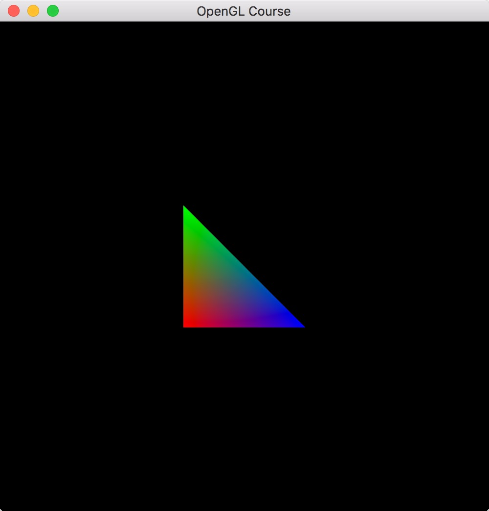

*********************************
座標変換 |source_code|
*********************************

.. |source_code| image:: ../../images/octcat.png
  :width: 24px
  :target: https://github.com/tatsy/OpenGLCourseJP/blob/master/src/004_coordinate_transformation/main.cpp

.. raw:: html

  

    注) この回は、全ての回の中で最も重要な回です。非常に難しい部分ですので、めげずに何度も復習しましょう。
  

二次元の座標変換
-------------------------

ここまでの回では、二次元座標上に三角形を描画していました。「 :doc:`../index/002` 」でご紹介したとおり、
画面上の座標系は :math:`(-1, 1) \times (-1, 1)` のようになっています。

ですが、実用的な場面では、当然、この座標系を変更したい場面というのが出てきます。
それでは、この座標系は変換できるのでしょうか？

結論から言えば、この座標系を変換することはできません。
ですが、描画する物体のサイズを変更することで擬似的に画面の座標系を変換することはできます。

例えば、今、画面の座標系を :math:`(-2, 2) \times (-2, 2)` のようにしたいとします。
とすれば、描画する全ての物体のサイズを2分の1にしておけば、これは :math:`(-1, 1) \times (-1, 1)`
の画面上にあたかも :math:`(-2, 2) \times (-2, 2)` の座標系を持つ画面上に物体を描画することができます。

それでは早速試してみましょう。

物体のサイズを変更する関数は ``glScalef`` です。この関数は引数を3つ取り、それぞれ
x軸、y軸、z軸の方向の拡大縮小比を表します。今回はx軸方向とy軸方向を2分の1に縮小したいので、

.. code-block:: cpp

  glScalef(0.5f, 0.5f, 1.0f);

のように書けばOKです。これをどこに書くのか、という部分についてですが、ここには少し工夫が必要です。

上記の ``glScalef`` はOpenGLの内部で管理されている座標変換行列に対して、
スケールを変更する行列を掛け算する、という処理をします。

具体的にはOpenGLの内部に保存されている座標変換行列は4×4の行列になっていて、
``glScalef(sx, sy, sz)`` のように呼び出したとすると、

.. math::

  \begin{pmatrix}
    sx & 0 & 0 & 0 \\
    0 & sy & 0 & 0 \\
    0 & 0 & sz & 0 \\
    0 & 0 & 0 & 1 \\
  \end{pmatrix}

という行列を掛け算することになります。

この行列をOpenGLの管理する行列に掛け算するには以下のように記述する必要があります。

.. code-block:: cpp
  :linenos:

  glMatrixMode(GL_MODELVIEW);
  glLoadIdentity();
  glScalef(0.5f, 0.5f, 1.0f);

これを使って、前回作成した描画関数を次のように書き換えます。

.. code-block:: cpp
  :linenos:

  // OpenGLの描画関数
  void paintGL() {
      // 背景色の描画
      glClear(GL_COLOR_BUFFER_BIT);

      // 座標変換
      glMatrixMode(GL_MODELVIEW);
      glLoadIdentity();
      glScalef(0.5f, 0.5f, 1.0f);

      // 三角形の描画
      glBegin(GL_TRIANGLES);
      glColor3f(1.0f, 0.0f, 0.0f);    // 赤
      glVertex2f(-0.5f, -0.5f);
      glColor3f(0.0f, 1.0f, 0.0f);    // 緑
      glVertex2f(-0.5f,  0.5f);
      glColor3f(0.0f, 0.0f, 1.0f);    // 青
      glVertex2f( 0.5f, -0.5f);
      glEnd();
  }

コードを書き換えて実行すると、左側の図のような画像が出てるはずです。
右側に比較用の元画像を表示してあります。

.. csv-table::
   :widths: 5, 5

   |after_scale|, |before_scale|
   **座標変換後**, 座標変換前

.. |before_scale| image:: ./figures/before_scale.jpg
  :width: 250px

ソースコードでは、特に頂点の座標を変換していませんが、実際に表示される三角形は縮小されており、
擬似的に座標系が :math:`(-2, 2) \times (-2, 2)` になっていることが分かります。

練習1
^^^^^^^^^^^^

``glTranslatef`` 関数は頂点を平行移動させる関数です。この関数を使って、画面の擬似的な座標系を
:math:`(0, 4) \times (0, 4)` にしてみてください。

----

OpenGLが管理する座標変換行列
-------------------------------------

ここからいよいよ、三次元の物体を表示するための方法について解説していきます。
その際、大切になる考え方が、今回のテーマでもある座標変換行列です。

先ほど、OpenGLは座標変換のための行列を管理しており ``glScalef`` はその行列に対して、
拡大縮小の行列を掛ける関数であると説明しました。
実は、OpenGLが管理している行列には射影変換行列とモデルビュー変換行列の2種類があり、
上記のコードではモデルビュー変換行列に対して掛け算をしています。

その掛け算をする対象となる行列を指定する関数が、先ほど使った ``glMatrixMode`` 関数です。
``glMatrixMode`` 関数には ``GL_MODELVIEW`` と ``GL_PERSPECTIVE`` のどちらかを
指定することができて、前者がモデルビュー変換行列を後者が射影変換行列を指定するための定数です
(実際にはあと2種類 ``GL_TEXTURE`` と ``GL_COLOR`` が指定できますが、通常あまり使いません)。

以下では、射影変換行列とモデルビュー変換行列の役割を解説しながら、
三次元物体を描画する仕組みについて考えてみたいと思います。

モデルビュー変換行列の役割
^^^^^^^^^^^^^^^^^^^^^^^^^^^^^^^^^^^^^^^

モデルビュー変換行列は物体が持つ座標を、その物体を見ている視点(カメラ)を中心とした座標系に変換する行列です。
このとき、変換前の物体固有の座標系のことを **ワールド座標系** 、カメラを中心とした座標系のことを **カメラ座標系** と呼びます。

例えば、今、原点に半径が1の単位球がおいてあるとしましょう。この球の中心の座標は当然ながら、
:math:`(0, 0, 0)` ですが、これはワールド座標系での座標です。

もしこの球を、:math:`(0, 0, 10)` から見ているならば、カメラ座標系における球の座標は、
:math:`(0, 0, 10)` になります。ここで気をつけたいのは、もしこの球を :math:`(10, 0, 0)`
から見ていたとしても、カメラ座標系は :math:`(0, 0, 10)` に成るという点です。

これは何故かと言うと、通常カメラ座標系は水平方向右をx軸の正の方向、垂直方向上をy軸の正方向、
そして、奥行きに対応するで、視線と反対向きの方向をz軸の正方向とするためです。

.. image:: ./figures/camera_coordinates.jpg

なお、上記のようにx, y, z軸の並びが右手の親指、人差し指、中指の順番になっているような
座標系を右手座標系と呼びます。OpenGLは右手座標系を使用していますが、
Microsoft社が開発している三次元描画のライブラリであるDirectXでは、左手座標系を使用しています。

射影変換行列の役割
^^^^^^^^^^^^^^^^^^^^^^^^^^^^^

射影変換行列はカメラ座標系に変換された行列をOpenGLのウィンドウが映し出す範囲である
:math:`(-1, 1) \times (-1, 1)` に変換する行列です。このとき変換後の座標系のことを
**スクリーン座標系** と呼びます。

射影変換行列には主に2種類があって、それぞれ **平行投影変換** (Orthographic projection) と
**透視投影変換** (Perspective projection) と呼びます。
平行投影変換は、その名前の通り、カメラ座標系のxy平面に対して平行に物体の座標を投影します。
一方、透視投影変換はカメラ座標系の原点と、オブジェクト平面と呼ばれる平面との交点を
スクリーン座標とします。

上記の方法によりスクリーン座標のx軸、y軸に対応する値は決定できますが、実はスクリーン座標にはz軸も存在します。
このzの値もx, yの値と同じように-1から1の値を取ります。この値を決定するために使われるのが
**近辺クリッピング面** (Near clipping plane) と **遠方クリッピング面** (Far clipping plane) です
(クリッピング面を指す日本語が見当たらなかったので、著者が適当につけた訳になります)。

これらのクリッピング面は視線方向と直交する平面で、近辺クリッピング面と交差する位置が
スクリーン座標における :math:`z = 0` の平面、遠方クリッピング面と交差する位置が、
スクリーン座標における :math:`z = 1` の平面となります。

平行投影変換
""""""""""""""""""""""

ここからは、射影変換行列を定義する変数と、実際に出来上がる行列について見ていきたいと思います。
まずは平行投影変換です。

OpenGLの関数には平行投影変換を扱う ``glOrtho`` という関数 |doc_glOrtho| が用意されていますのでこれを使います。

.. code-block:: cpp
  :linenos:

  glOrtho(GLdouble left, GLdouble right, GLdouble bottom, GLdouble top, GLdouble nearVal, GLdouble farVal);

.. |doc_glOrtho| image:: ../../images/popup.png
  :width: 16px
  :target: https://www.opengl.org/sdk/docs/man2/xhtml/glOrtho.xml

この関数は上記の通り引数を6つ取ります。最初の2つがスクリーン座標系での左端と右端に対応するカメラ座標系でのxの値、
次の2つが下端と上端に対応するyの値、そして最後が近辺クリッピング面と遠方クリッピング面に対応するzの値です。

今、平行投影変換をしたいカメラ座標が :math:`(x_c, y_c, z_c)` であるとします。
この時、変換後のスクリーン座標 :math:`(x_s, y_s, z_s)` は次のように表せます。

.. math::

  x_s &= 2 \frac{x_c - left}{right - left} - 1   &= \frac{2 x_c - (right + left)}{right - left}\\
  y_s &= 2 \frac{y_c - bottom}{top - bottom} - 1 &= \frac{2 y_c - (top + bottom)}{top - bottom}\\
  z_s &= 2 \frac{z_c - nearVal}{farVal - nearVal} - 1 &= \frac{2 z_c - (farVal + nearVal)}{farVal - nearVal}

したがって、平行投影変換のための行列は以下のように書けます。

.. math::

  \begin{pmatrix}
    \frac{2}{right - left} & 0 & 0 & -\frac{right + left}{right - left} \\
    0 & \frac{2}{top - bottom} & 0 & -\frac{top + bottom}{top - bottom} \\
    0 & 0 & \frac{2}{farVal - nearVal} & -\frac{farVal + nearVal}{farVal - nearVal} \\
    0 & 0 & 0 & 1
  \end{pmatrix}

ここで注意したいのは、座標変換のための行列は4×4の行列だという部分です。
これは、3次元のベクトルに対する3×3の行列による変換では平行移動などの一部の変換が
扱えないためで、通常のx, y, zの値に対応する3次元ベクトルに4つ目の要素として1を付け加えた
:math:`(x, y, z, 1)` という行列に変換行列を作用させていくことになります。

このような座標表現のことを **同次座標表現** と呼び、これにより様々な変換を表すことができるのですが、
ここでは、考え方の紹介にとどめ、詳細については他の資料に譲ることとします。

透視投影変換
""""""""""""""""""""""

平行投影変換と異なり、透視投影変換の行列を扱う関数はOpenGLには用意されていません。
少しややこしいのですが、OpenGLには、主に数学的な機能をまとめたGLU (GL utility) というライブラリが含まれており、
こちらに透視投影変換を扱う関数があります。

GLUライブラリを使うためには、 ``GL/glu.h`` というヘッダをインクルードします。

.. code-block:: cpp
  :linenos:

  #include <GL/glu.h>

これをGLFWで使うためには、以下のように ``GLFW_INCLUDE_GLU`` を定義します。

.. code-block:: cpp
  :linenos:

  #define GLFW_INCLUDE_GLU
  #include <GLFW/glfw3.h>

透視投影変換を扱う関数は ``gluPerspective`` という関数です。

.. code-block:: cpp
  :linenos:

  gluPerspective(GLdouble fov, GLdouble aspect, GLdouble zNear, GLdouble zFar);

こちらの関数は4つの引数を取ります。最初の引数が、カメラから画面を見たときの上下方向の開き角、
2つ目の引数が、画面の縦横比 (アスペクト比)、3つ目と4つ目の引数が近辺クリッピング面と
遠方クリッピング面に対応するzの値です。

平行投影変換のときと同じく、カメラ座標 :math:`(x_c, y_c, z_c)` をスクリーン座標
:math:`(x_s, y_s, z_s)` に変換する操作を考えてみます。

平行投影変換の場合にはx, yの値は、カメラと変換する点とを結んだ直線と近辺クリッピング面との交点により決まります。
この時、スクリーンの上下左右の端は開き角とアスペクト比により決まります。

少し複雑ではあるのですが、x, yの値は次のように変換できます。

.. math::

  x_s &= \frac{x_c}{(-z_c) \tan \left( \frac{fov}{2} \right) aspect} \\
  y_s &= \frac{y_c}{(-z_c) \tan \left( \frac{fov}{2} \right) }

さて、問題はzの値です。平行投影の時と同じように考えると、カメラから変換したい点までの
距離を測って、それが :math:`nNear` から :math:`zFar` の間に収まるように
すれば良さそうなのですが、実際には、もう少し複雑な処理をします。

ここでポイントとなるのはx, yの値がどのくらい拡大縮小されているか、という点です。
図で示すとおり、透視投影変換は四角錐台の領域を立方体に変換します。

この時、四角錐台の軸に垂直な平面で切った切り口はzの絶対値が小さいときには小さく、
zの絶対値が大きいときには大きくなっています。ところが、立方体に変換した後には、
いずれの場合も同じ大きさの四角形に変換されます。

ということは、x, yの値は、zの絶対値が小さいときには大きく、zの絶対値が大きいときには小さくなるという
反比例の関係があることが分かります。透視投影変換では、zの拡大・縮小度合いがx, yの拡大縮小度合いと
同じになるように変換をします。すなわち、ある未知数 :math:`a, b` を使って、

.. math::

  z_s = \frac{a}{z_c} + b

のような関係式が成り立つことを意味します。ここで、 :math:`z_c = zNear` が-1に、
:math:`z_c = zFar` が1に移ることを利用すると、

.. math::

  \begin{cases}
    \frac{a}{zNear} + b = -1 \\
    \frac{a}{zFar} + b  = 1
  \end{cases}

という連立方程式が得られます。これを解くと、

.. math::

  a &= -\frac{2 zFar \cdot zNear}{zNear - zFar} \\
  b &= -\frac{zNear + zFar}{zNear - zFar}

となって、 :math:`z_c` から :math:`z_s` への変換が得られます。

この変換を行列として書き出したいのですが、問題は、変換後の値に :math:`z_c` の逆数が含まれるという点です。
通常の行列による変換では、変換前の変数の逆数を表現することはできません。

ですが、同時座標表現においては、常に4つ目の値が1になるようにベクトルをスケールします。
したがって、もし :math:`z_c` で割る必要があるのならば、4つ目の値が :math:`z_c` になるように
行列を作れば良いということになります。

カメラ座標系においては、視線方向にz軸の負の方向が対応しており、上記の四角錐台が広がっている方向では
:math:`z_c` が負であることに注意すると、変換後の4次元ベクトルは、

.. math::

  \left(
    \frac{x_c}{ \tan \left( \frac{fov}{2} \right) aspect},
    \frac{y_c}{ \tan \left( \frac{fov}{2} \right)},
    \frac{zNear + zFar}{zNear - zFar} (-z_c) + \frac{2 zFar \cdot zNear}{zNear - zFar},
    -z_c
  \right)

したがって、透視投影変換の行列は以下のように書けます。

.. math::

  \begin{pmatrix}
    \frac{1}{\tan \left( \frac{fov}{2} \right) aspect} & 0 & 0 & 0 \\
    0 & \frac{1}{\tan \left( \frac{fov}{2} \right)} & 0 & 0 \\
    0 & 0 & \frac{zNear + zFar}{zNear - zFar} & \frac{2 zFar \cdot zNear}{zNear - zFar} \\
    0 & 0 & -1 & 0
  \end{pmatrix}

立方体の表示
----------------------------

ここまでで立方体を表示するための基礎知識は紹介できました。そこで、早速、三次元物体の最初として
色のついた立方体を描画してみます。ここでは、重要なコードの断片だけを説明しますが、
第4章のまとめコードには全体のコードがありますので、そちらを参考にしながらプログラムを書いてみてください。

まずは、立方体を定義している部分ですが、こちらは以下のようなコードになります。
コメントにある通り、上から頂点の位置、面の色、頂点を結ぶ順番を表しています。

.. code-block:: cpp
  :linenos:

  // 立方体の頂点位置
  static const float positions[8][3] = {
      { -1.0f, -1.0f, -1.0f },
      {  1.0f, -1.0f, -1.0f },
      { -1.0f,  1.0f, -1.0f },
      { -1.0f, -1.0f,  1.0f },
      {  1.0f,  1.0f, -1.0f },
      { -1.0f,  1.0f,  1.0f },
      {  1.0f, -1.0f,  1.0f },
      {  1.0f,  1.0f,  1.0f }
  };

  // 立方体の面の色
  static const float colors[6][3] = {
      { 1.0f, 0.0f, 0.0f },  // 赤
      { 0.0f, 1.0f, 0.0f },  // 緑
      { 0.0f, 0.0f, 1.0f },  // 青
      { 1.0f, 1.0f, 0.0f },  // イエロー
      { 0.0f, 1.0f, 1.0f },  // シアン
      { 1.0f, 0.0f, 1.0f },  // マゼンタ
  };

  // 立方体の面となる三角形の定義
  static const unsigned int indices[12][3] = {
      { 1, 6, 7 }, { 1, 7, 4 },
      { 2, 5, 7 }, { 2, 7, 4 },
      { 3, 5, 7 }, { 3, 7, 6 },
      { 0, 1, 4 }, { 0, 4, 2 },
      { 0, 1, 6 }, { 0, 6, 3 },
      { 0, 2, 5 }, { 0, 5, 3 }
  };

続いては、実際の描画部分です。大きく変わっている部分は、ビューポート変換の設定の部分と
座標変換行列の設定の部分になります。

以下のコードでは、まず、 ``glViewport`` 関数でビューポートを画面サイズと同じにしています。
そのあとで ``glMatrixMode`` 関数に ``GL_PROJECTION`` を渡して、透視投影変換行列を
``gluPerspective`` 関数で設定しています。最後は ``glMatrixMode`` 関数に ``GL_MODELVIEW``
を渡して、モデルビュー行列を ``gluLookAt`` 関数で設定しています。

ここの設定だと、カメラは ``(3.0, 4.0, 5.0)`` の位置にあり ``(0.0, 0.0, 0.0)`` の位置を見ていることになります。

.. code-block:: cpp
  :linenos:

  // OpenGLの描画関数
  void paintGL() {
      // 背景色の描画
      glClear(GL_COLOR_BUFFER_BIT);

      // 座標の変換
      glMatrixMode(GL_PROJECTION);
      glLoadIdentity();
      gluPerspective(45.0f, (float)WIN_WIDTH / (float)WIN_HEIGHT, 0.1f, 1000.0f);

      glMatrixMode(GL_MODELVIEW);
      glLoadIdentity();
      gluLookAt(3.0f, 4.0f, 5.0f,     // 視点の位置
                0.0f, 0.0f, 0.0f,     // 見ている先
                0.0f, 1.0f, 0.0f);    // 視界の上方向

      // 立方体の描画
      glBegin(GL_TRIANGLES);
      for (int face = 0; face < 6; face++) {
          glColor3fv(colors[face]);
          for (int i = 0; i < 3; i++) {
              glVertex3fv(positions[indices[face * 2 + 0][i]]);
          }

          for (int i = 0; i < 3; i++) {
              glVertex3fv(positions[indices[face * 2 + 1][i]]);
          }
      }
      glEnd();
  }

こちらのコードを実行すると以下のような画像が得られるはずです。少しおかしいのが分かるでしょうか。
今描いている立方体の前面には赤、緑、青の面が来るはずですが、裏面にあるはずの、イエロー、マゼンタ、
シアンの面が見えています。

これは、現在の設定だと物体が視点から見てどういう順番にあるのかを考慮していないためで、
単純に描画した順に色が塗り重ねられているためです。これを解決する方法については第5回の「深度テスト」で解説します。

.. image:: ./figures/strange_cube.jpg
  :width: 250px

練習 2
^^^^^^^^^^^^^^^^^^^^^^^^^^^^

(1) ``gluOrtho`` 関数を使って、投影変換行列を平行投影変換に変更してみてください。
(2) 立方体の面の描画順を変更するとどうなるか試してみてください。
(3) 【発展】 ``glMultMatrixf`` 関数は長さが16の ``float`` の配列を受け取って、それを現在の行列モード( ``GL_MODELVIEW`` や ``GL_PROJECTION`` )に設定する関数です。この関数を ``gluPerspective`` や ``gluLookAt`` の代わりに使って描画をしてみましょう。
